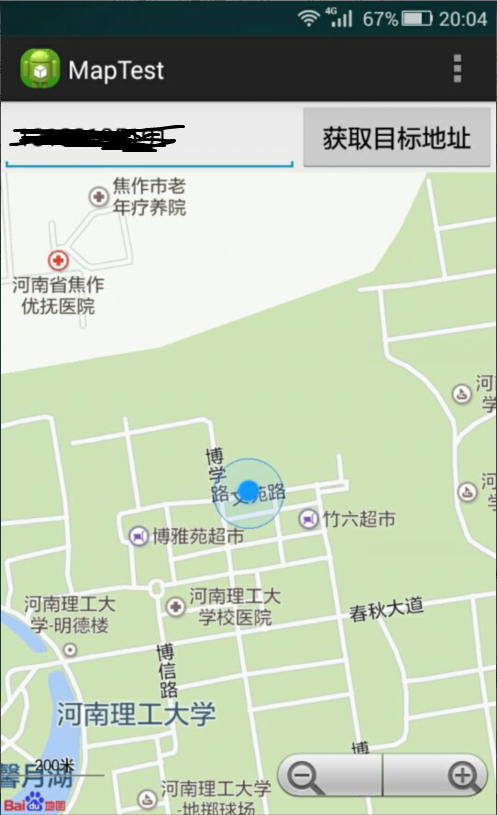

---------------------------需求分析1.0--------------------------------
LocateGet:
1.	位置获取：系统基本功能，让子女通过程序获取老人位置
2.	导航：子女获取老人位置后，LocateGet将提供到达目标位置的路线导航

LocateShare:
1.	权限授予：从保护用户隐私出发，只有被目标授权的电话号码，才能使用LocateGet从LocateShare获取位置
2.	一键呼救：老人发生紧急情况需要帮助时，通过快捷键将自己的位置一键共享给LocateShare中的授权号码

效果图：
